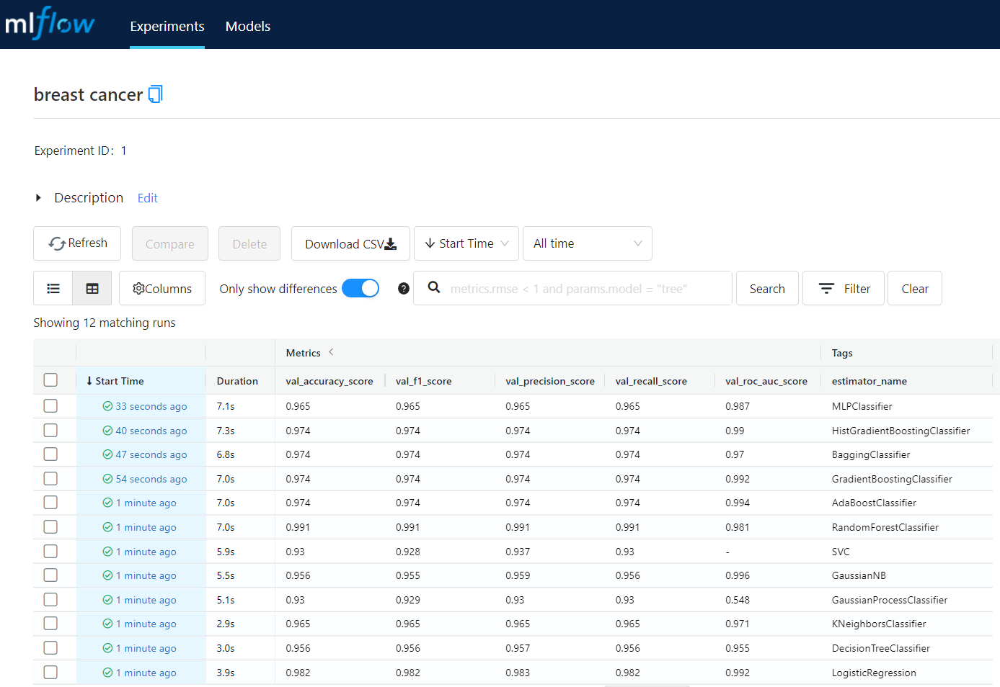
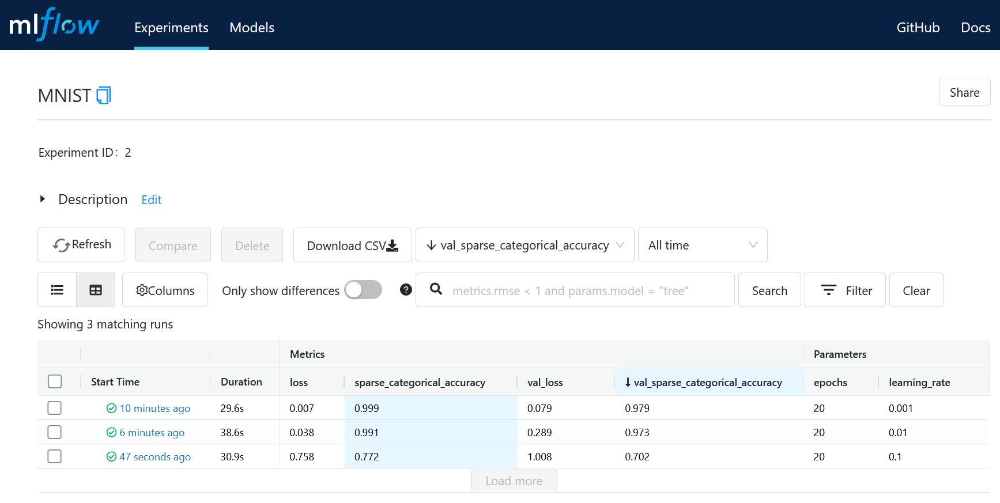
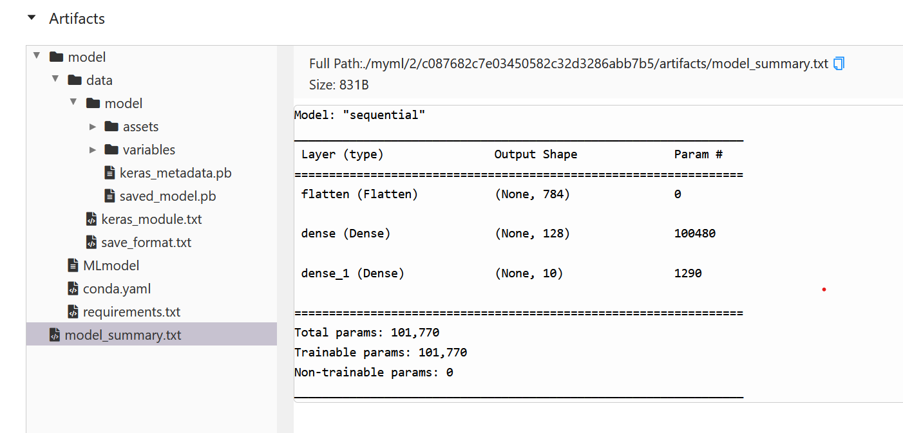
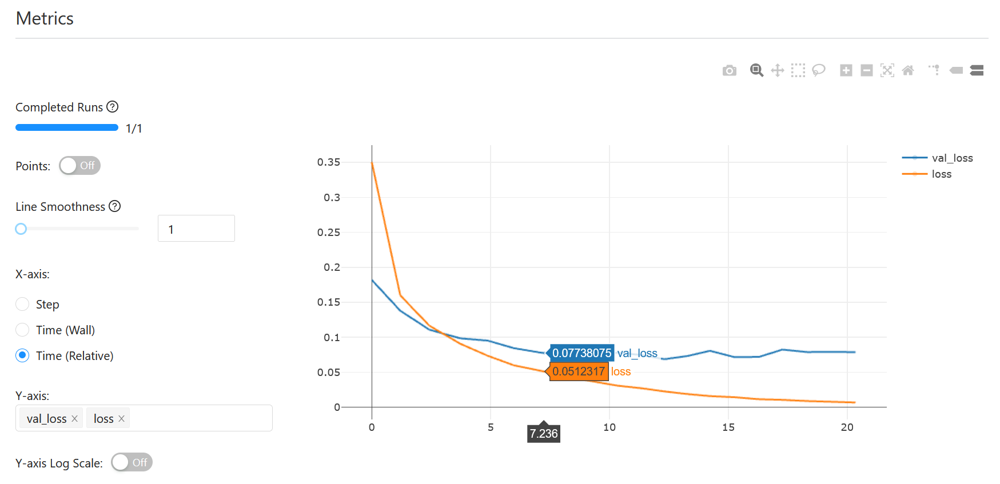
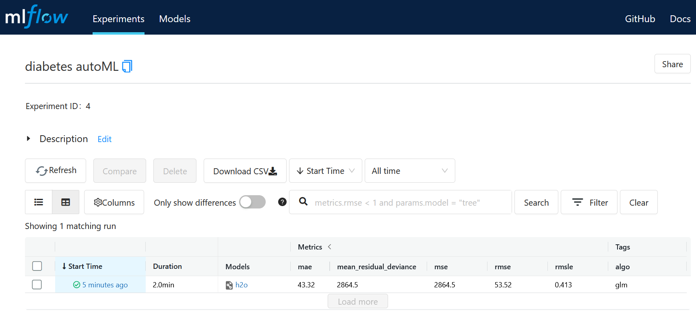
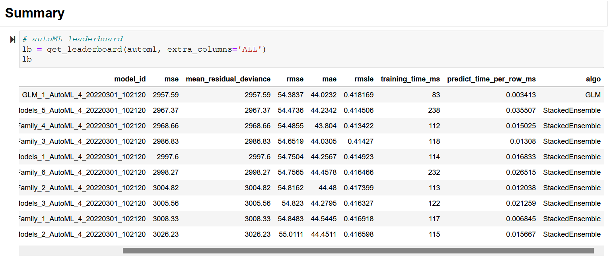

# Quick Tutorial

https://www.slideshare.net/Hadoop_Summit/introducing-mlflow-an-open-source-platform-for-the-machine-learning-lifecycle-for-onprem-or-in-the-cloud

  

## 1. Setup
### optional packages
- [anaconda](https://www.anaconda.com/products/individual) (environment manager)
- [docker](https://www.docker.com/products/docker-desktop) (container manager)
- [java](https://www.java.com/download/ie_manual.jsp) (required for running H2O)

### environment
example:

    conda create -n mlops python=3.7
    conda activate mlops

### python dependencies
    pip install -r requirements.txt
    pip install -f http://h2o-release.s3.amazonaws.com/h2o/latest_stable_Py.html h2o

## 2. MLflow Tracking
MLflow Tracking is an open-source API for live logging of parameters, metrics, and metadata when running a machine learning code. It provides valuable information and visibility that enables you to monitor the progress of the training process and take action if necessary.

  

### create working directory
    mkdir mlflow_tutorial
    cd mlflow_tutorial

### create training script
code examples:
- sklearn ([script](https://github.com/taufik-adinugraha/mlflow-quick-start/blob/main/train_sklearn.py))
- tensorflow ([script](https://github.com/taufik-adinugraha/mlflow-quick-start/blob/main/train_tensorflow.py))
- xgboost & lgbm ([notebook](https://github.com/taufik-adinugraha/mlflow-quick-start/blob/main/train_xgb_lgb.ipynb))
- autoML with H2O ([notebook](https://github.com/taufik-adinugraha/mlflow-quick-start/blob/main/train_h2o_automl.ipynb))
    
### run MLflow server
- open new terminal/console with the same environment and run the server

        mlflow server --backend-store-uri <URI> --default-artifact-root <URI> --host X.X.X.X --port port_number
  
  where \<URI\> can either be a URI for a remote server, or a local path to log data to a directory
  
  example when using local directory *myml*:
    
        mlflow server --backend-store-uri ./myml --default-artifact-root ./myml --host 0.0.0.0 --port 5000

- open the UI through web browser on `http://localhost:5000` or `http://X.X.X.X:5000`

### training
- run *train_sklearn.py*:
           
        python train_sklearn.py
     

- run *train_tensorflow.py*:

        python train_tensorflow.py
     
     
     

- run *train_xgb_lgb.ipynb*: 

     

- run *train_h2o_automl.ipynb* (only save the best model): 

     
     

## 3. MLflow Projects
An MLflow Project is a format for packaging data science code in a reusable and reproducible way, based primarily on conventions. In addition, the Projects component includes an API and command-line tools for running projects, making it possible to chain together projects into workflows.

  

Main components:
- 'MLproject' file
- script (.py or .sh) as an entry point
- data source

Run Example:

    mlflow run git@github.com:mlflow/mlflow-example.git -P alpha=0.5

## 4. MLflow Models
An MLflow Model is a standard format for packaging machine learning models that can be used in a variety of downstream tools—for example, real-time serving through a REST API or batch inference on Apache Spark. The format defines a convention that lets you save a model in different “flavors” that can be understood by different downstream tools.

  

### model deployment
- local REST API server

        mlflow models serve -m /path_to_model/ -h X.X.X.X -p port_number
    
    example:
    
        mlflow models serve -m /path_to_model/ -h 0.0.0.0 -p 1234

- docker
    - build docker image
    
            mlflow models build-docker -m /path_to_model/ -n image_name 

      example:
      
            mlflow models build-docker -m /path_to_model/ -n image_name 
            
    - run docker container

            docker run -p 8080:8080 image_name

### test the endpoint

    curl -X POST -H "Content-Type:application/json; format=pandas-split" --data json_data http://X.X.X.X:portnumber/invocations

example:

    curl -X POST -H "Content-Type:application/json; format=pandas-split" --data '{"columns":["alcohol", "chlorides", "citric acid", "density", "fixed acidity", "free sulfur dioxide", "pH", "residual sugar", "sulphates", "total sulfur dioxide", "volatile acidity"],"data":[[12.8, 0.029, 0.48, 0.98, 6.2, 29, 3.33, 1.2, 0.39, 75, 0.66]]}' http://127.0.0.1:1234/invocations
    
    
## 5. MLflow Model Registry
The MLflow Model Registry component is a centralized model store, set of APIs, and UI, to collaboratively manage the full lifecycle of an MLflow Model. It provides model lineage (which MLflow experiment and run produced the model), model versioning, stage transitions (for example from staging to production), and annotations.

  

Not available in community version. [More info](https://www.mlflow.org/docs/latest/model-registry.html)
