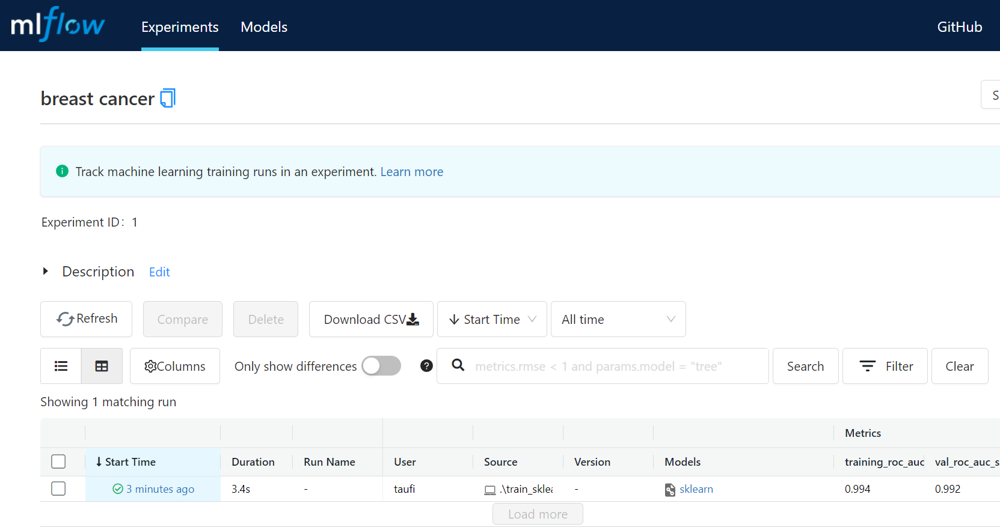

# Quick Start

## setup environment
    conda create -n mlops python=3.7
    conda activate mlops

## install dependencies
    pip install mlflow
    pip install matplotlib
    pip install scikit-learn

## initiate project
    mkdir mlflow_quick
    cd mlflow_quick
    git init .

## create training script
code examples:

## run training script
    python train_sklearn.py
    
## dashboard
- open new terminal with the same environment and run the ui    
     
      mlflow ui --backend-store-uri <URI>
  where \<URI\> can either be a HTTP/HTTPS URI for a remote server, or a local path to log data to a directory  
  - example for local path:
  
        mlflow ui --backend-store-uri ./myml
  - example for remote server:
        
        mlflow ui --backend-store-uri postgresql://URI
- open the ui through web browser
  - example for local path:
        
        http://127.0.0.1:5000
  - example for local server

        http://127.0.0.1:5000
        
      
