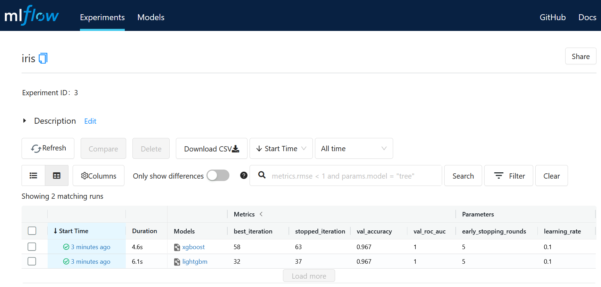

# Quick Start

## setup environment
    conda create -n mlops python=3.7
    conda activate mlops

## install dependencies
    pip install -r requirements.txt
    pip install -f http://h2o-release.s3.amazonaws.com/h2o/latest_stable_Py.html h2o

## initiate project
    mkdir mlflow_quick
    cd mlflow_quick
    git init .

## create training script
- code examples:
    - sklearn ([code](https://github.com/taufik-adinugraha/mlflow-quick-start/blob/main/train_sklearn.py))
    - tensorflow ()
    - xgboost & lgbm ()
    - autoML with h2o ()
- commit:

        git add *
        git commit -m 'first commit'
    
## run MLflow server
- open new terminal with the same environment and run the server
     
      mlflow server --backend-store-uri <URI>
  where \<URI\> can either be a HTTP/HTTPS URI for a remote server, or a local path to log data to a directory  
  - example:
  
        mlflow server --backend-store-uri ./myml --default-artifact-root ./myml --host 0.0.0.0 --port 5000

- open the ui through web browser on `http://127.0.0.1:5000`

## training
- run scripts:
           
        python train_sklearn.py
     
    
        python train_tensorflow.py

- run notebooks: 

     

## deployment
